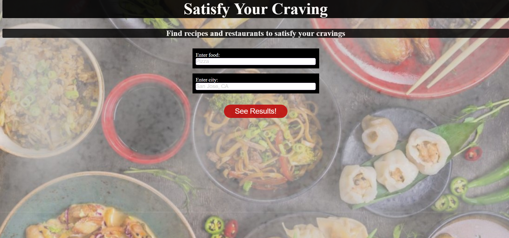

## "Satisfy Your Craving" | Thinkful API Capstone
The Satisfy Your Craving app is designed for travelers, foodies, and cooking enthusiasts alike. It allows a User to search for the food they are craving and get a list of video recipes, written recipes, and a list of restaurants.

## Screenshots

Home Page View
:-------------------------:|:-------------------------:

User Results

## User Cases
This app is for any user who is hungry and would either like to cook the food they are craving or go to a restaurant to eat the food they're craving:
1. For those who prefer to cook and watch a video showing how to cook their craving step by step.
2. For those who prefer to read a recipe and cook what they are craving.
3. For those who would rather pay for someoene else to cook for them and go to a restaurant in the city of their choice.

### UI Flow

### Wireframe

## Working Prototype
You can access a working prototype of the app here: https://blancahc.github.io/Satisfy-Ur-Craving/

## Functionality
The app's functionality includes:
* Every User has the ability to search for the food they are craving and get a list of videos on how to prepare that food, written recipes and a list of nearby restaurant names with their addresses.

## Technology
* Front-End: HTML5 | CSS3 | JavaScript ES6 | jQuery

## Responsive
App is strongly built to be usuable on mobile devices, as well as responsive across mobile, tablet, laptop, and desktop screen resolutions.

## Development Roadmap
This is v1.0 of the app, but future enhancements are expected to include:
* Map showing nearby restaurants of the food item searched
* Actual restaurant pictures with customer reviews
